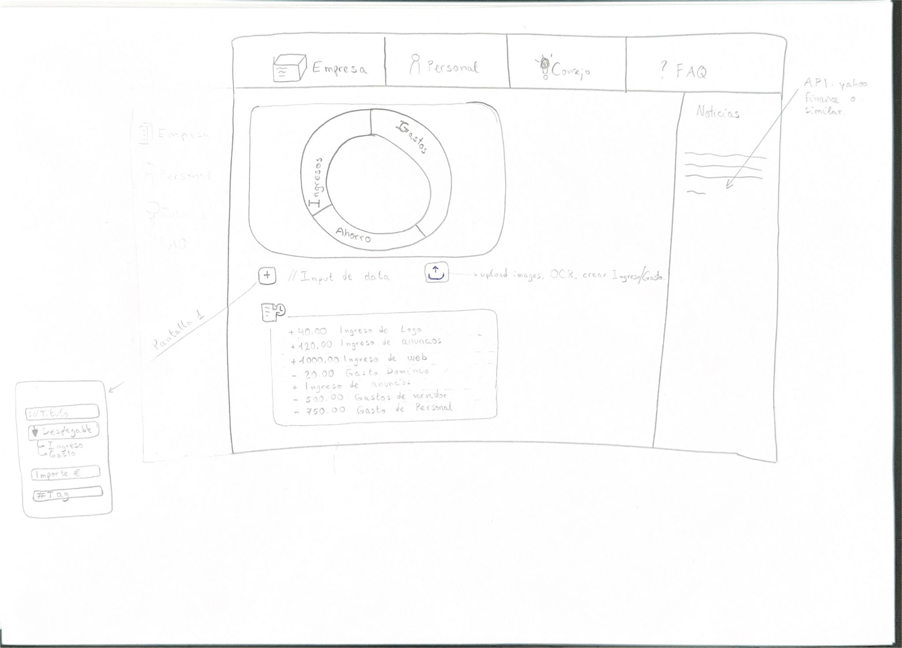

# Guia instalacion

cd /Finsave/app 
npm install 
npm i json2csv jsonwebtoken cookie-parser morgan dotenv 
npm run dev  

# FinSave  
_Ahorra jugando, aprende creciendo._

   
  📌 <b>Boceto de la web</b>

Documento de [RF](https://ceu365-my.sharepoint.com/:w:/g/personal/gabriel_lazovskyigual_usp_ceu_es/EUta0UbD4RhMsot5hp6VB7MBX9FZESix9fx7_nO_TtEOJA?e=d8dmcj) 
Repo en [Github](https://github.com/gabriellazovsky/FinSave)  
Planner / Tracker [Excel](https://ceu365-my.sharepoint.com/:x:/g/personal/gabriel_lazovskyigual_usp_ceu_es/EWb1pyBopRxLh-Lyw6ZotAgBfAv7Ny9QGAhdEXcQ0_AqCQ?e=PEez7y) 

---
